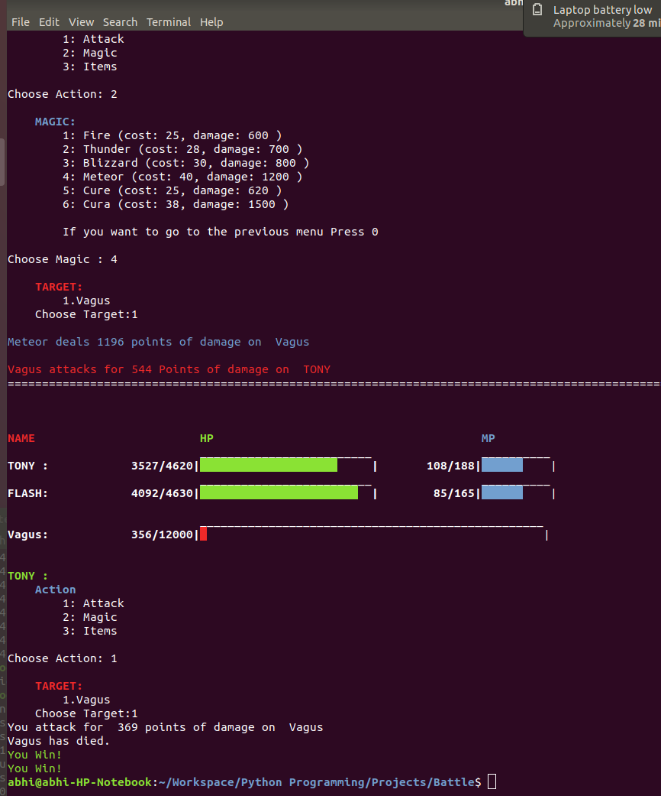

# Battle-Script
**Battle Script: A Command Line Scripted Game**

Language: Python3

FEATURES OF THE CODE -

1. Use of classes and all the basic stuffs used in the game of the python3.

2. A Command Line based program in which all the basic features of python3 is used.

Features of Game :

1. This game has three players which is controlled by the user and three enemy players which is Controlled by the computer itself.

2. The players have their own HitPoints(HP) and MagicPoints(MP) which gets updated after every round of attack and displayed on the command window.

3. The enemy has its own Hp and Mp. Only the hit points of enemy gets displayed to the user.

2. The user can select the type of action and the players which they want to attack.

3. There are three options which are given to the user :

        1. Attack
        2. Magic
        3. Items

4. The player can choose the player they wanted to attack from the list. The list gets updated after every attack.

        1.  Imp
        2.  Vagus
        3.  Cric
        
5. In the **Attack** type of action the user attacks the specific target according to their capacity which is set by the user.

6. In the **Magic** option user choose the spells they want to use. There are two types of spell.

        1. White :
                A. Cure
                B. Cura
        2. Black :
                A. Fire
                B. Thunder
                C. Blizzeard
                D. Meteor
    
    These spells will take up some cost which will gets reduced from player's magic points.
    
7. In the **Items** option user will choose the items from the given list of things 
        
        1.  Potion
        2.  Hi-Potion
        3.  SuperPotion
        4.  Elixer
        5.  MegaElixer
        6.  Grenade
        
8. The enemy has its own Artificial Intelligence. It can choose the type of attacks and spells and can also heal itself during the game according to the situation.
   The spells and the healing capacity of the enemy will cost the enemy its magic points. 
       

_See the Screenshots of the  Command Line

